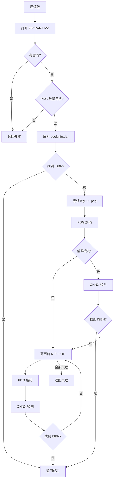

# 压缩包提取流程

从 ZIP / RAR / UVZ 压缩包中提取 CIP 信息。

## 流程概述



## 关键步骤

### 1. 格式支持

通过 `_ArchiveReader` 抽象层统一访问三种格式：

| 格式 | 实现 |
|------|------|
| ZIP / UVZ | `zipfile.ZipFile`（标准库） |
| RAR | `patool` + 系统 `unrar` |

### 2. 密码保护检测

通过尝试读取 `ZipFile` 元数据判断是否有密码。
**有密码保护的压缩包直接返回失败**，不支持密码破解。

### 3. PDG 数量阈值

统计压缩包内 `*.pdg` 文件数量：

```python
pdg_min_count = 30   # 少于 30 个 PDG 文件则跳过
pdg_fallback_count = 5  # 兜底时尝试的前 N 个 PDG 文件数
```

可在配置中调整：

```python
configure(archive_pdg_min_count=50, archive_pdg_fallback_count=10)
```

### 4. bookinfo.dat 解析

从压缩包中读取 `bookinfo.dat` 文件：

1. **解码** — 先尝试 GB18030，失败回退 UTF-8
2. **解析** — 提取 `[Section]` 下的 `key=value` 格式
3. **字段映射** — 将各种别名标准化（如 `"ISBN号"` → `isbn`，`"SS号"` → `ssid`）

成功提取 ISBN 即返回，**避免后续 ONNX 检测路径**。

### 5. SSID 回退

即使没有 ISBN，`ssid`（SS 号）也可作为标识（严格等级 ≥ 4 时通过校验）。

### 6. PDG 解码

`_pdg_to_image()` 的流程：

1. **检查文件头** — 是否 JPEG（`\xff\xd8\xff`）或 PNG（`\x89PNG`）
2. **标准图片** — 直接 PIL 打开（部分 PDG 仅仅是 jpg/png 改名）
3. **非标准格式** — 使用 `PdgView.dll` 解码（通过 ctypes 调用）
4. **兜底** — 直接让 PIL 尝试打开

### 7. ONNX 检测

解码后的图片送入 `Detector.process()` 走标准检测管线。

## 配置项

| 参数 | 默认值 | 说明 |
|------|--------|------|
| `archive_pdg_min_count` | 30 | PDG 数量低于此值跳过提取 |
| `archive_pdg_fallback_count` | 5 | 兜底时尝试的 PDG 文件数 |
| `archive_pdgview_path` | `"pdgview/PdgView.dll"` | PdgView.dll 路径 |
