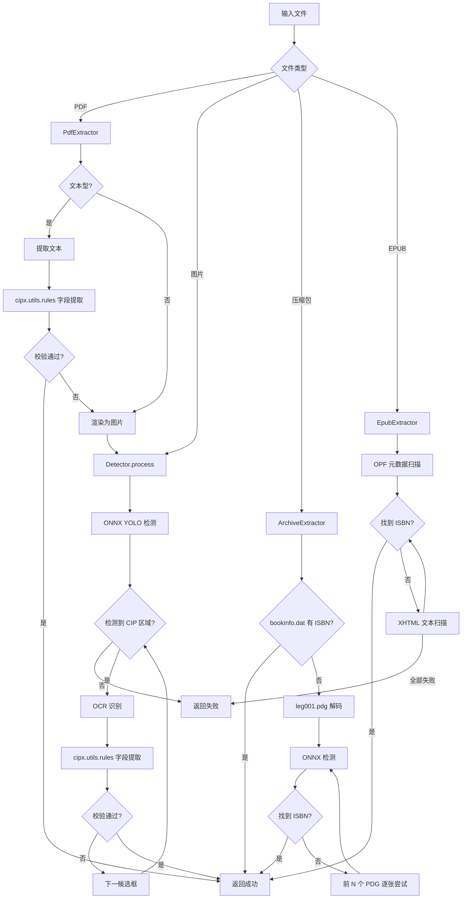

# CIP 提取全流程概览

`cipx` 的整体提取管线。

## 总体流程

## 核心组件

| 组件 | 职责 |
|------|------|
| `CIPX` | 统一入口，根据文件类型路由到对应的提取器 |
| `Detector` | ONNX YOLO 检测器，定位 CIP 区域并裁剪 |
| `CIPXRapidOCR` | 基于 RapidOCR 的文字识别引擎 |
| `extract_cip_fields` | 从 OCR 文本行中提取书名、作者、出版社等字段 |
| `BookInfo` | 提取结果的数据模型，含严格等级校验 |

## 处理管线

所有文件类型最终都会汇聚到 **Detector.process()** 方法，完成以下四步：

1. **ONNX 推理** — YOLO 模型检测图片中的 CIP 区域，返回候选框列表
2. **OCR 识别** — 对每个候选框裁剪图片 → 缩放 → RapidOCR 文字识别
3. **字段提取** — `extract_cip_fields()` 解析 OCR 文本，提取 6 个核心字段
4. **校验** — 按 `settings.strict` 等级校验 BookInfo 有效性，通过即返回

## 校验等级

参见 `config.py` 中 `Settings.strict` 的说明：

| 等级 | 规则 |
|------|------|
| 1（最严格） | 全部 6 个核心字段 + ssid 都不能缺失 |
| 2 | 全部 6 个核心字段都不能缺失 |
| 3 | ≥3 个核心字段，且必须含 ISBN |
| 4（默认） | ≥3 个核心字段，且 ISBN 或 ssid 至少有一个 |
| 5 | ≥3 个核心字段 |
| 6 | ISBN 有效即有效 |
| 7 | ≥1 个核心字段 |
| 8（最宽松） | ≥1 个字段（含 ssid） |
