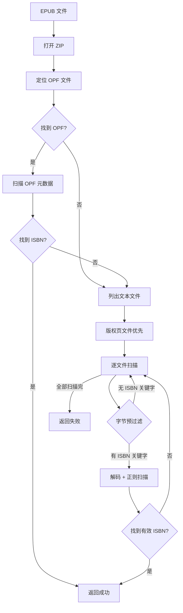

# EPUB 提取流程

从 EPUB 文件中提取 ISBN，纯文本扫描，无需 ONNX 检测和 OCR。

## 流程概述



## 关键步骤

### 1. OPF 元数据优先

通过 `META-INF/container.xml` 定位 OPF 文件，扫描其内容提取 ISBN。
OPF 中包含 `<dc:identifier>` 等结构化元数据，**命中即返回**，无需后续扫描。

### 2. 字节级预过滤

在真正解码文件之前，先用字节正则快速过滤：

```python
_BYTE_GATE = re.compile(rb"isbn|97[89][\d\- Xx]{10,}", re.IGNORECASE)
```

**优点**：避免对不含 ISBN 的文件做无效解码，大幅提升扫描速度。

### 3. 版权页优先

以下关键词命中的文件优先扫描：

```
copyright, copyr, titlepage, title, front,
colophon, imprint, verso, credits,
leg001, leg0001, colop
```

这些文件通常包含 ISBN 信息。

### 4. 文本扫描

对通过预过滤的文件：

1. **解码** — 自动检测编码：UTF-8 → UTF-16-LE → GB18030 → Big5
2. **正则匹配** — 两步扫描：
   - 优先匹配 `ISBN` 标记后的数字（支持各种分隔符）
   - 回退到 `978`/`979` 开头的 13 位候选
3. **校验** — 用 `mneia-isbn` 库校验 ISBN 有效性，通过即返回

### 5. 限制条件

| 参数 | 值 | 说明 |
|------|-----|------|
| `_MAX_BYTES` | 10 MB | 单个文件最大读取大小 |
| `_MAX_SCAN` | 200 | 最多扫描 200 个文本文件 |
| `_TEXT_EXTS` | `.opf, .xhtml, .html, .htm, .xml` | 扫描的文件扩展名 |

## 特点

- **纯文本扫描** — 无需 ONNX 检测和 OCR，速度极快（通常 1~10ms）
- **多编码支持** — UTF-8 / UTF-16-LE / GB18030 / Big5 自动检测
- **轻量** — 只提取 ISBN 字段，不提取书名/作者等其他 CIP 字段
