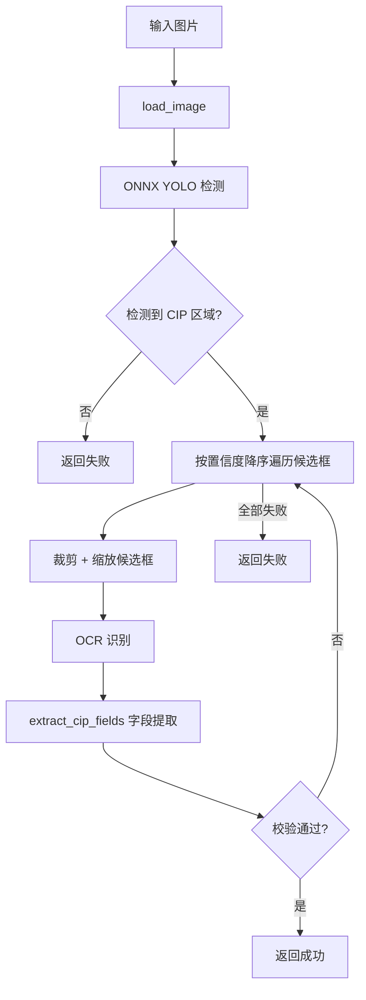
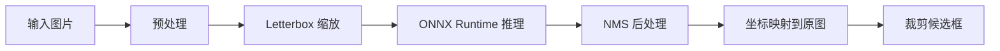

# 图片提取流程

从单张图片文件中提取 CIP 信息的完整流程。

## 流程概述



## 关键步骤

### 1. 图片加载

`load_image()` 统一处理多种输入格式：

- 文件路径（`str` / `Path`）
- 字节数据（`bytes`）
- OpenCV 矩阵（`MatLike` / `ndarray`）
- PIL Image

自动进行 **EXIF 矫正**（`ImageOps.exif_transpose`），统一转换为 RGB。

### 2. ONNX YOLO 检测

`Detector.detect()` 的详细流程：



- **预处理**：Letterbox 缩放至 `640×640`，保持宽高比，填充灰色
- **推理**：ONNX Runtime（CPU），支持多线程配置
- **后处理**：NMS 去除冗余框，筛选置信度 ≥ `conf_threshold`（默认 0.3）
- **坐标映射**：将模型输出坐标还原到原始图片尺寸

### 3. OCR 识别

对每个检测到的 CIP 区域：

1. **裁剪** — 从原图中抠出检测框区域
2. **缩放** — 确保尺寸在 `[min_input_dim, max_input_dim]` 范围内（默认 300~960px）
3. **文字识别** — 基于 RapidOCR 引擎，识别中文文本

### 4. 字段提取

`extract_cip_fields()` 从 OCR 文本行中提取：

- **ISBN** — 匹配 `ISBN` 标记后的数字序列（支持跨行），回退到 978/979 开头的候选
- **CIP 核字号** — 支持 `CIP数据核字(2021)第188747号` 等多种格式
- **书名** — 定位 `图书在版编目` 头部行的书目上下文
- **作者** — 从著者信息行提取
- **出版社** — 从出版信息行提取
- **出版日期** — 从出版信息行提取

### 5. 校验

按 `settings.strict` 等级校验提取结果，**任意候选框通过即返回**。
全部候选框均不满足时，若 `keep_partial=True` 则保留已提取的部分字段。

## 检测类别

`cipx` 的 ONNX 模型只检测 **CIP 页**（class_id=0），与 `isbnx` 不同（后者还检测条形码和独立 ISBN 文字）。

```python
DETECT_CLASSES = {
    0: "cip",  # 出版社 CIP 页
}
```
