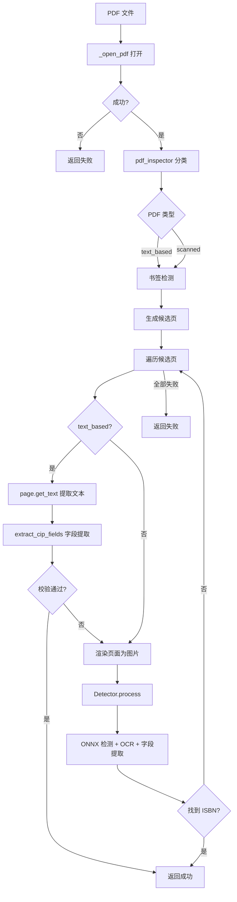

# PDF 提取流程

从 PDF 文件中提取 CIP 信息，支持文本型 PDF 和扫描件。

## 流程概述



## 关键步骤

### 1. 打开 PDF

`_open_pdf()` 处理：

- 文件存在性检查
- 密码保护检测（`doc.needs_pass`）
- 空页检查（`doc.page_count == 0`）
- 格式损坏兜底

### 2. PDF 类型判断

使用 `pdf_inspector.detect_pdf()` 判断类型：

| 类型 | 含义 | 处理策略 |
|------|------|----------|
| `text_based` | 文本型 PDF | 优先文本提取，失败后渲染图片 |
| `scanned` | 扫描件 | 直接渲染图片 → ONNX 检测 |
| `image_based` | 图片型 PDF | 同 scanned |
| `mixed` | 混合型 | 同 scanned |

### 3. 书签检测

`_check_bookmarks()` 按关键词在书签（TOC）中查找版权页：

```python
_BOOKMARK_RULES = [
    (re.compile(r"版\s*权"), 0),  # "版权"，优先级最高
]
```

命中书签的页码会被插入候选页列表最前面。

### 4. 候选页生成

`_get_candidate_pages()` 根据 `PDFConfig` 生成候选页：

- **前页**：第 2 ~ 10 页（`front_start=2, front_end=10`）
- **后页**：倒数第 5 ~ 1 页（`back_start=5, back_end=1`）
- 去重，书签页按优先级排在前面

可在配置中调整：

```python
configure(
    pdf_front_start=1,
    pdf_front_end=15,
    pdf_back_start=8,
    pdf_back_end=1,
)
```

### 5. 文本提取（text_based）

从 PDF 页面提取文本后，调用 `extract_cip_fields()` 尝试提取全字段。
**只要校验通过即立即返回**，不继续后续页面。

### 6. 渲染 + ONNX 检测

文本提取失败或非文本型 PDF 时：

1. 以 `2.0x` 缩放渲染页码为 PIL Image
2. 调用 `Detector.process()` 走完整 ONNX + OCR + 字段提取管线

## 配置项

| 参数 | 默认值 | 说明 |
|------|--------|------|
| `pdf_front_start` | 2 | 前页搜索起始页 |
| `pdf_front_end` | 10 | 前页搜索结束页 |
| `pdf_back_start` | 5 | 后页搜索起始页（从后往前） |
| `pdf_back_end` | 1 | 后页搜索结束页（从后往前） |
